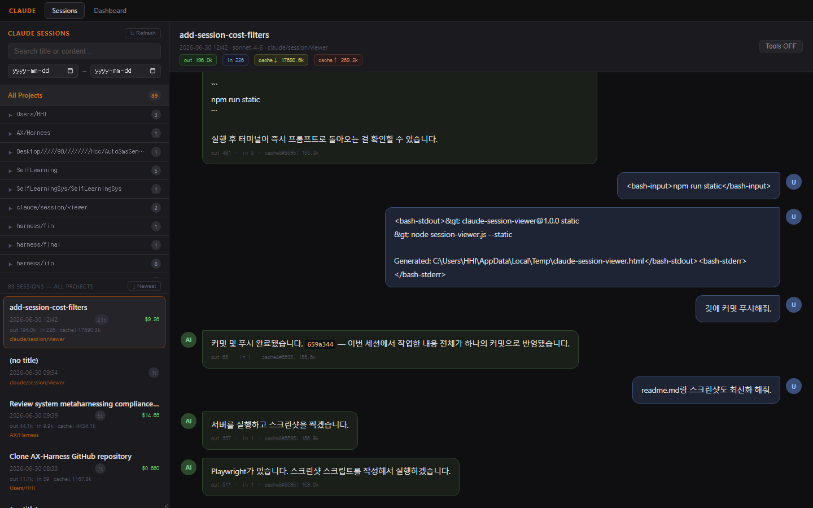
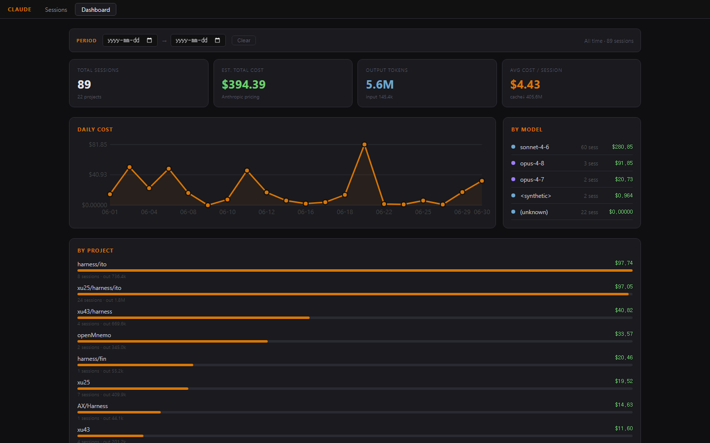

# claude-session-viewer

Local web viewer for **Claude Code** session history — browse conversations, track token usage, analyze costs.

## Features

- **Session list** — project tree, search by title/content, date range filter, newest/oldest sort toggle
- **Cost display** — estimated cost per session shown inline in the list
- **Conversation view** — full message history with token counts; Tools ON/OFF reveals tool calls (with inputs) and tool results
- **Dashboard** — date range filter updates all charts and stats in real time
  - Daily cost line chart, by-model breakdown, by-project bars
  - Sortable per-session cost table
- **Static export** — generate a standalone HTML file with no server required (`npm run static`)
- **KST timezone** — dates displayed in local time

## Requirements

- Node.js 16+
- Claude Code installed (sessions stored in `~/.claude/projects/`)

## Usage

### Run without installing

```bash
npx github:Malburi/claude-session-viewer
```

### Clone and run

```bash
git clone https://github.com/Malburi/claude-session-viewer.git
cd claude-session-viewer
npm start
```

Then open **http://localhost:3000** in your browser.

### Static mode (no server)

```bash
npm run static
```

Generates a self-contained HTML file with all session data embedded and opens it directly in the browser. No server process runs.

### Install globally

```bash
npm install -g github:Malburi/claude-session-viewer
claude-session-viewer
```

## Options

```
--port <n>   Use a different port (default: 3000)
--no-open    Don't auto-open the browser
--static     Generate standalone HTML file and exit
```

## Pages

| Page | URL | Description |
|------|-----|-------------|
| Sessions | `/` | Browse & read session history |
| Dashboard | `/dashboard` | Cost & token usage analytics |

## Screenshots

**Sessions** — project tree, date filter, cost per session, sort toggle, tool content



**Dashboard** — period filter, stat cards, daily cost chart, model & project breakdown


